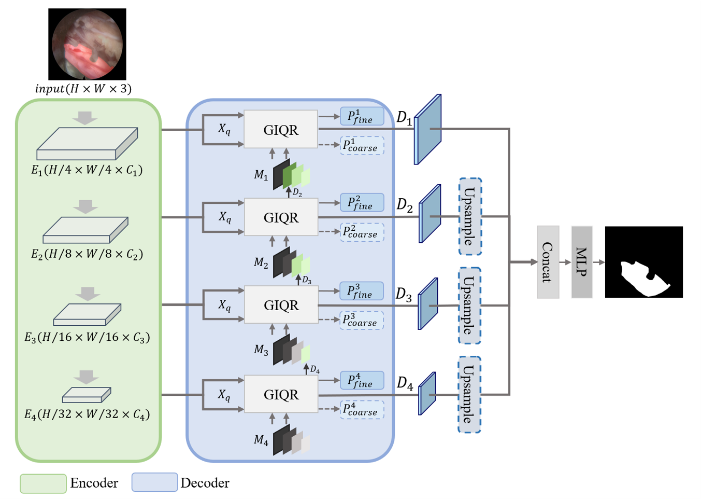
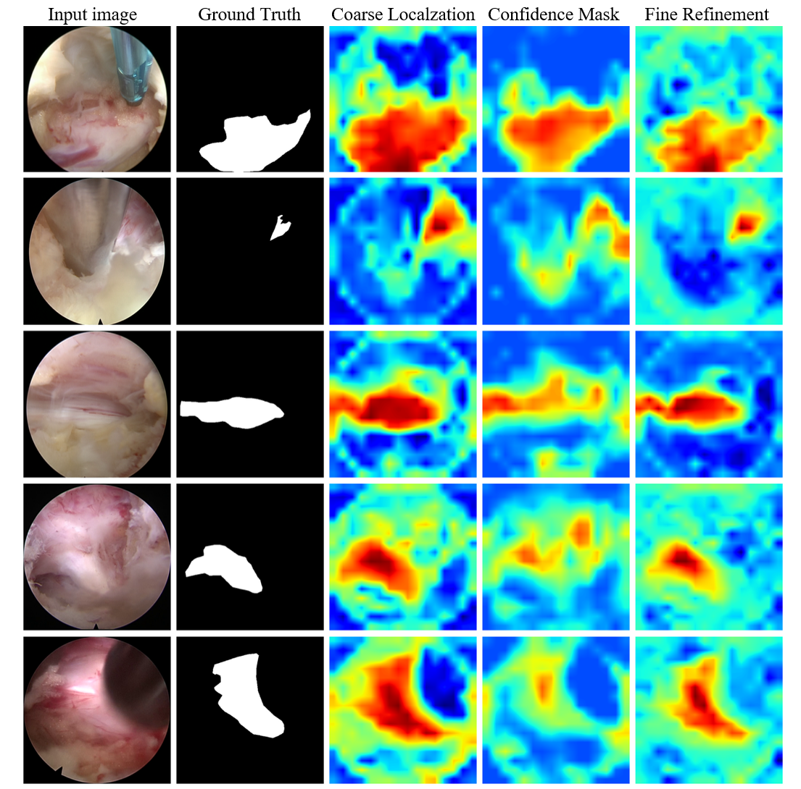

# BRI-MixFormer: Boundary Iterative Hybrid Network for Intraoperative Nerve Segmentation in PELD
## Project Introduction
<div align="center">
  
</div>
<p align="center">
  Overall architecture of the proposed BRI-MixFormer.
</p>

This implementation is improved based on the lightweight CNN-Transformer hybrid segmentation framework [U-MixFormer](https://arxiv.org/abs/2312.06272), targeting pixel-level segmentation of fully exposed nerve roots during Percutaneous Endoscopic Lumbar Discectomy (PELD).

Traditional endoscopic segmentation models suffer from encoder-biased design, poor extraction of faint nerve features, severe contour distortion, and weak robustness against intraoperative occlusion. We propose two core innovations:
1. **GIQR (Global Iterative Query Refinement) Module**: Multi-scale confidence mask filters background noise from surgical instruments and adipose tissue; cross-layer feature back-propagation iteratively repairs broken slender nerve edges.
2. **IRB (Iterative Region Boundary Loss)**: Combines Dice-Focal region loss and Sobel gradient edge loss to jointly optimize region integrity and contour precision.

The model maintains lightweight parameters and real-time inference speed for intraoperative navigation. It achieves state-of-the-art metrics on our self-built clinical PELD dataset, and strong cross-domain generalization is validated on five public gastrointestinal polyp datasets.

<div align="center">
  
</div>
<p align="center">
  Qualitative segmentation comparison under instrument occlusion and low-contrast surgical fields.
</p>

## Verified Environment Versions
We build the project based on [MMSegmentation v1.0.0](https://github.com/open-mmlab/mmsegmentation/tree/v1.0.0).
### Core Dependencies
- Python: 3.10
- PyTorch: 2.1.0+cu121
- CUDA (bundled with PyTorch): 12.1
- mmengine: 0.10.7
- mmcv: 2.1.0
- mmsegmentation: 1.0.0
- timm: 1.0.25
- opencv-python: 4.13.0.92

### Full Installation Script
```bash
# 1. Create conda environment (optional)
conda create -n openmmlab python=3.10 -y
conda activate openmmlab

# 2. Install PyTorch matched with CUDA 12.1
pip install torch==2.1.0 torchvision==0.16.0 torchaudio --index-url https://download.pytorch.org/whl/cu121

# 3. Install OpenMMLab libraries
pip install mmengine==0.10.7 mmcv==2.1.0 mmsegmentation==1.0.0

# 4. Auxiliary vision packages
pip install timm==1.0.25 opencv-python==4.13.0.92 pillow scipy matplotlib

# 5. Install custom modules of this project
python setup.py install
```

## Directory Layout
```
BRI-MixFormer-main/
├── data/                    # PELD clinical dataset & polyp public dataset scripts
├── datasets/                # Custom dataset & augmentation pipeline
├── demo/                    # Single-image inference visualization
├── docs/                    # Paper figures & experimental records
├── mmseg/models/decode_heads/ # Core BRI-MixFormer decoder (modified from U-MixFormer)
├── pretrain/                # MiT lightweight backbone weights
├── projects/                # All training & ablation config files
├── resources/               # Segmentation comparison & heatmap figures
├── tools/                   # Train / test entry scripts
├── work_dirs/               # Auto-saved checkpoints, logs and metrics
├── setup.py                 # Registration script for custom networks
└── README.md                # This file
```

## Dataset Description
1. **Self-built PELD Clinical Dataset**
Intraoperative endoscopic images collected from tertiary hospitals with pixel-level nerve annotations. The split ratio is `train:val:test = 8:1:1`.
This clinical dataset involves patient privacy and is **not publicly available**, only used for internal experiments.
2. **Public Polyp Generalization Datasets**
Five publicly available gastrointestinal endoscopic datasets: Kvasir, CVC-ClinicDB, ColonDB, ETIS, EndoScene. All datasets can be downloaded openly for cross-domain generalization evaluation.

## Training & Evaluation Commands
### Single GPU Training
```bash
python tools/train.py configs/brimixformer/peldconfig.py
```

### Evaluate Checkpoint on Validation Set
```bash
python tools/test_peld_final.py work_dirs/xxx/best_mDice.pth
```


